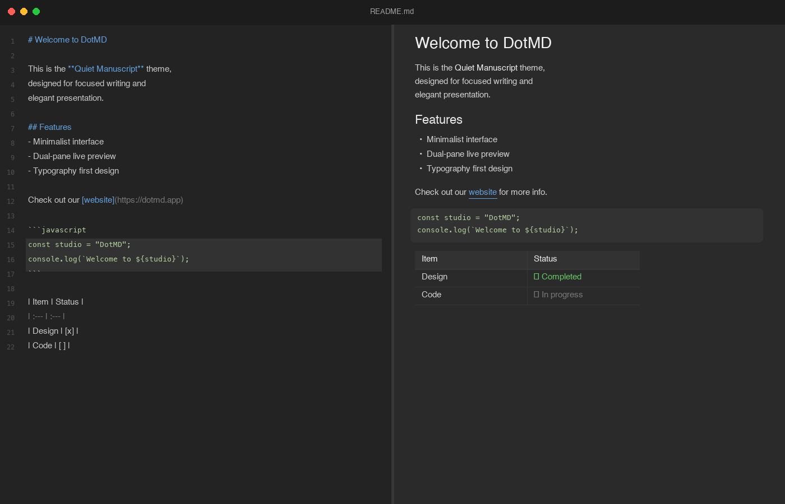

# DotMD

A native, free macOS markdown editor with split-pane live preview.

[](LICENSE)
[](https://github.com/tribagusu/dotmd/releases/latest)



## Features

- **Split-pane live preview** — write markdown on the left, see rendered output instantly on the right
- **Draggable divider** — adjust the editor/preview split to your preference
- **Syntax highlighting** — color-coded headings, bold, code, and links in the editor
- **Light & dark themes** — follows system preference, or override manually
- **Open from Finder** — double-click any `.md` file to open it in DotMD
- **Adjustable font size** — `Cmd+Plus` / `Cmd+Minus`, remembered across sessions
- **Lightweight** — under 4 MB, launches instantly, built with Tauri + Rust

## Install

1. Download the latest `.dmg` from [GitHub Releases](https://github.com/tribagusu/dotmd/releases/latest)
2. Open the DMG and drag **DotMD** to your **Applications** folder
3. Since the app is unsigned, run this once in Terminal:

```bash
xattr -cr /Applications/DotMD.app
```

4. Open DotMD normally — you only need to do step 3 once.

### Verify file integrity

Each release includes a `checksums.txt` file. After downloading, verify the DMG wasn't tampered with:

```bash
shasum -a 256 ~/Downloads/DotMD_*.dmg
```

Compare the output with the hash in `checksums.txt` on the release page. They must match exactly.

## Build from source

Requires [Node.js](https://nodejs.org/) (18+), [Rust](https://rustup.rs/), and the [Tauri CLI](https://tauri.app/start/).

```bash
git clone https://github.com/tribagusu/dotmd.git
cd dotmd
npm install
npm run tauri build
```

The built app will be at `src-tauri/target/release/bundle/macos/DotMD.app`.

## Tech stack

- **Frontend:** React + TypeScript + CodeMirror + react-markdown
- **Backend:** Rust (Tauri v2)
- **Bundling:** Vite

## License

[MIT](LICENSE)
